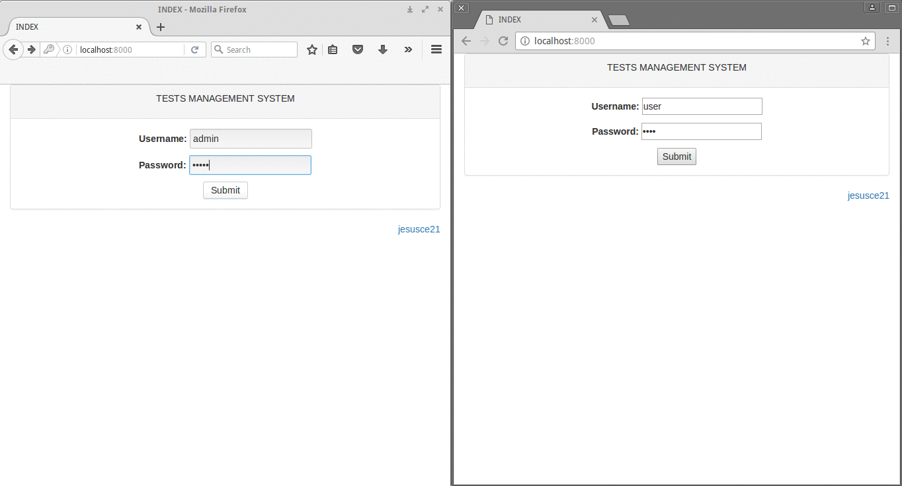

# Users management

"Users management" is a system for managing users easily. This system allows dynamically generate forms.

# Requeriments
  - POSTGRESQL 9.4.5
  - Python 2.7.6
    - Django==1.10.1
    - psycopg2==2.6.2

### Installation
```sh
$ git clone https://github.com/jesusce21/users_management.git
```

### Test
```sql
-- Insert in "users_management_scheme"
1;"user_profile";"[{"name": "description", "type": "string", "label": "Description", "placeholder": "Define your description..."}, {"name": "type", "type": "select", "label": "Type", "option": [["1", "A"], ["3", "C"], ["4", "D"], ["5", "F"]]}]"

-- Insert in "users_management_user"
1;"admin";"admin";"{}"
```

### View example


### Json structure
Permitted types
```json
["int", "float", "time", "date", "datetime", "long_string", "string", "select"]
```

Option for ["int", "float", "time", "date", "datetime", "long_string", "string"]
```json
{"type":"", "label": "", "name": "", "placeholder":"", "help_text": "", "required": ""}
```

Option for ["select"]
```json
{"type":"", "label": "", "name": "", "help_text": "", "required": "", "option": [[,]]}
```

### Next version
- Admin configuration: It allows the administrator to modify the json structure.
